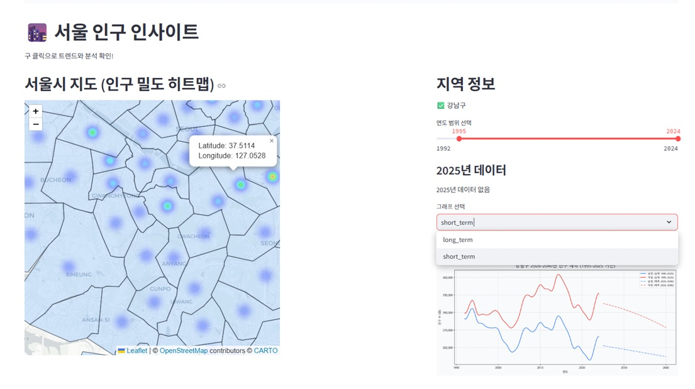

# 🗺️ population-insight-app

서울시 각 구의 남녀 인구 데이터를 시각화하고 향후 5년간 인구를 예측하며, AI를 통해 통계적 인사이트 및 정책 제언을 제공합니다.

---

## 📌 주요 기능

- 🗺️ 지도 클릭으로 지역 선택 (Folium + GeoJSON)
- 📈 과거 ~ 현재 인구 데이터 시각화 (matplotlib)
- 🔮 2차 다항회귀 기반 미래 인구 예측
- 🧠 HuggingFace API 기반 한국어 LLM을 활용한 인구 분석 및 정책 제안 생성

---

## 🔍 사용 기술

| 기술             | 설명                                               |
|------------------|----------------------------------------------------|
| `Streamlit`      | 웹 기반 대시보드 프레임워크                         |
| `MongoDB`        | 지역별 남녀 인구 데이터 저장                        |
| `Scikit-Learn`   | 다항 회귀 기반 인구 예측                            |
| `HuggingFace API`| KoAlpaca, KULLM 등 한국어 LLM 모델 사용             |
| `Folium`         | 지도 상에서 구 선택 기능 구현                        |
| `Matplotlib`     | 인구 추세 및 예측 시각화                            |

---

## 📸 실행 예시



---

## 🚀 실행 방법

```bash
# 필요한 패키지 설치
pip install -r requirements.txt

# 실행
streamlit run project_seoul.py
